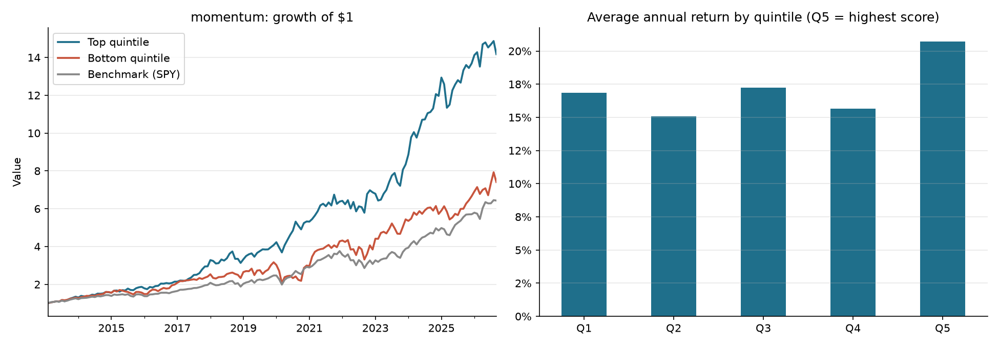

# Equity Factor Research

Tests whether common stock factors (momentum, low volatility, short term reversal) predicted next month returns for a universe of large US stocks, and screens today's universe using the same signals.

## What it does

**Backtest.** Every month end, stocks are ranked on a factor and split into five equal groups (quintiles). Each group is held equal weighted for the following month. If the factor works, the top quintile (Q5) should beat the bottom (Q1), and returns should rise fairly steadily from Q1 to Q5.

Reported for each quintile, the Q5 minus Q1 spread, and SPY: CAGR, volatility, Sharpe ratio, max drawdown, hit rate. Q5 is also shown after an estimated trading cost based on actual turnover.

**Screener.** Ranks current stocks on 12 month momentum, 6 month volatility, distance from 52 week high, trend (above 200 day average), and beta. With `--fundamentals` it adds forward P/E, price to book, ROE, debt to equity, and dividend yield, and blends them into a composite score.

## Run it

```bash
pip install -r requirements.txt
python run.py                      # momentum backtest + screener
python run.py --factor low_vol     # other factors: low_vol, reversal
python run.py --fundamentals       # slower, pulls valuation data per ticker
python run.py --demo               # fake data, no internet needed
```

Outputs land in `output/`: a summary table, monthly returns, a chart, and today's screen.

## Design choices

* **No lookahead.** Factor scores at month end only use prices through that date. Returns are measured over the *next* month.
* **12-1 momentum.** Skips the most recent month, the standard academic definition (Jegadeesh and Titman 1993), since one month returns tend to reverse.
* **Equal weight, monthly rebalance.** Simple and transparent. Cost assumption is 10 bps per side on names that change.

## Limitations
* **Survivorship bias.** The universe is today's large caps. Companies that shrank, were acquired, or went bankrupt are missing, which inflates historical returns. A proper test uses point in time index membership.
* **Small universe.** 60 stocks means 12 per quintile, so results are noisy.
* **Fundamentals are current only.** yfinance gives today's P/E, not historical, so valuation is used in the screener but not the backtest.
* **Beta varies by window.** The screener uses a 1 year daily beta. XOM showed about -0.57, close to GuruFocus's 3 year figure (about -0.47), but sites using longer windows may differ.


## Findings

### Momentum (2013 to 2026)


*Bar chart shows average monthly return × 12. Text figures are CAGR (compounded), which runs slightly lower for more volatile groups.*

**Did the top group beat the bottom?** Yes. The top momentum quintile returned 21.4% a year vs 15.8% for the bottom quintile. After estimated trading costs the top group still returned 20.7%, so turnover (about 24% a month) didn't eat much of the edge.

**Is the pattern consistent across groups?** Mostly. Sharpe ratio climbs steadily from 0.81 in Q1 to 1.35 in Q5. Raw returns are less clean, since Q3 beat Q4, but the risk adjusted numbers line up the way momentum theory predicts.

**Is it a tradable strategy on its own?** Not really. Buying Q5 and shorting Q1 only earned 2.2% a year, with a 49% max drawdown. The bigger takeaway is that momentum was better at flagging stocks to avoid. Q1 had the highest volatility (20.7%) and the worst drawdown (35%) of any group.

**Why not compare to SPY?** Every quintile beat or matched SPY, including the losers. That's survivorship bias. My universe is today's large caps, so it's filled with companies that already succeeded. The honest comparison is top quintile vs bottom quintile, not vs the index.

**How did it hold up in stress periods?** Better than I expected. In 2020, Q5 returned 30.7% vs a 5.5% loss for Q1. In 2022, when SPY fell 18.2%, Q5 still gained 7.6% while Q1 lost 10.1%.

The problem showed up the year after. The spread was negative 18.5% in 2021 and negative 16.8% in 2023. When the market recovers, the beaten down stocks rebound hardest and momentum ends up on the wrong side. This matches what research calls momentum crashes.

The spread was also positive in only 7 of 14 years. Most of the edge came from a handful of big years (2015, 2020, 2022, 2024), so this would be a hard strategy to stick with in real life.

### Comparing the three factors

| Factor | Top quintile CAGR | Bottom quintile CAGR | Long short Sharpe |
|---|---|---|---|
| Momentum | 21.4% | 15.8% | 0.22 |
| Low volatility | 11.5% | 25.3% | negative (0.67) |
| Reversal | 17.2% | 17.6% | 0.01 |

**Momentum** was the only factor that sorted stocks the right way.

**Low volatility** went the opposite direction from what research predicts. The most volatile stocks returned 25.3% a year vs 11.5% for the calmest. I think this is mostly survivorship bias. My universe includes NVDA, META, and AVGO, which are volatile stocks that only made the list because they turned into giants. The losers that would have dragged down the high volatility group aren't in the data. Low vol did cut risk, with a 14% max drawdown vs 24% for SPY.

**Reversal** showed no signal. That lines up with research showing short term reversal is mostly a small cap effect, tied to liquidity. In mega caps, last month's losers didn't bounce back any more than anything else. Trading costs also cost 2.2% a year, so a small edge wouldn't have survived anyway.

**Main lesson:** My universe choice probably shaped the results more than the factors did. That's the first thing I'd fix.

### What I'd test next

* Rerun on point in time S&P 500 membership to remove survivorship bias
* Expand to a few hundred stocks so each quintile is less noisy
* Combine momentum with low volatility, since Q1's main problem was risk
* Add a rule that cuts momentum exposure after big market drops, to avoid the 2021 and 2023 style crashes